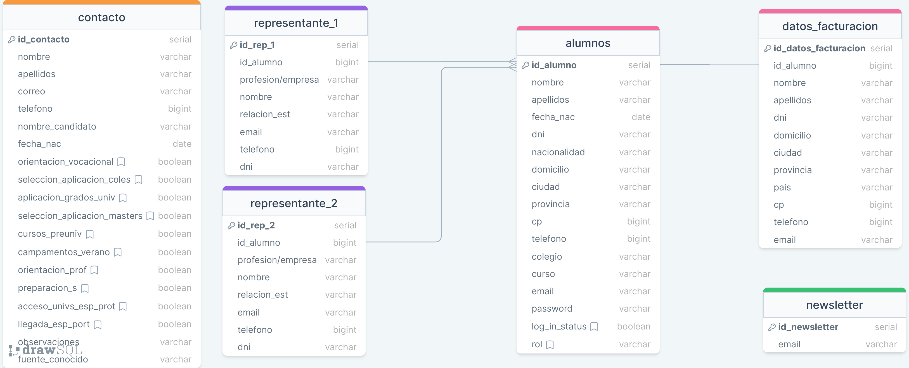

# Proyecto de Base de Datos de Gestión de Estudiantes

Este repositorio contiene el esquema de una base de datos para la gestión de estudiantes y sus representantes, así como su despliegue en Render para que sea accesible desde cualquier lugar.

## Descripción del Proyecto

La base de datos está diseñada para gestionar información sobre estudiantes, sus contactos y representantes, así como datos de facturación y suscripciones a newsletters.

### Tablas de la Base de Datos

- **contacto**: Información de contacto de los candidatos.
- **representante_1**: Información del primer representante del estudiante.
- **representante_2**: Información del segundo representante del estudiante.
- **alumnos**: Información personal y académica de los estudiantes.
- **datos_facturacion**: Información de facturación asociada a los estudiantes.
- **newsletter**: Suscripciones a la newsletter.

## Esquema de la Base de Datos

El siguiente es el esquema de la base de datos:



## Creación de la Base de Datos

Para crear la base de datos, sigue estos pasos:

1. **Configurar el entorno**: Asegúrate de tener instalado PostgreSQL en tu máquina local o en el servidor donde planeas desplegar la base de datos.
   
2. **Crear la base de datos**: Utiliza el siguiente script SQL para crear las tablas necesarias:
   
   ```sql
   CREATE TABLE contacto (
       id_contacto SERIAL PRIMARY KEY,
       nombre VARCHAR,
       apellidos VARCHAR,
       correo VARCHAR,
       telefono BIGINT,
       nombre_candidato VARCHAR,
       fecha_nac DATE,
       orientacion_vocacional BOOLEAN,
       seleccion_aplicacion_coles BOOLEAN,
       aplicacion_grados_univ BOOLEAN,
       seleccion_aplicacion_masters BOOLEAN,
       cursos_preuniv BOOLEAN,
       campamentos_verano BOOLEAN,
       orientacion_prof BOOLEAN,
       preparacion_s BOOLEAN,
       acceso_univs_esp_prot BOOLEAN,
       llegada_esp_port BOOLEAN,
       observaciones VARCHAR,
       fuente_conocido VARCHAR
   );

   CREATE TABLE representante_1 (
       id_rep_1 SERIAL PRIMARY KEY,
       id_alumno BIGINT,
       profesion_empresa VARCHAR,
       nombre VARCHAR,
       relacion_est VARCHAR,
       email VARCHAR,
       telefono BIGINT,
       dni VARCHAR
   );

   CREATE TABLE representante_2 (
       id_rep_2 SERIAL PRIMARY KEY,
       id_alumno BIGINT,
       profesion_empresa VARCHAR,
       nombre VARCHAR,
       relacion_est VARCHAR,
       email VARCHAR,
       telefono BIGINT,
       dni VARCHAR
   );

   CREATE TABLE alumnos (
       id_alumno SERIAL PRIMARY KEY,
       nombre VARCHAR,
       apellidos VARCHAR,
       fecha_nac DATE,
       dni VARCHAR,
       nacionalidad VARCHAR,
       domicilio VARCHAR,
       ciudad VARCHAR,
       provincia VARCHAR,
       cp BIGINT,
       telefono BIGINT,
       colegio VARCHAR,
       curso VARCHAR,
       email VARCHAR,
       password VARCHAR,
       log_in_status BOOLEAN,
       rol VARCHAR
   );

   CREATE TABLE datos_facturacion (
       id_datos_facturacion SERIAL PRIMARY KEY,
       id_alumno BIGINT,
       nombre VARCHAR,
       apellidos VARCHAR,
       dni VARCHAR,
       domicilio VARCHAR,
       ciudad VARCHAR,
       provincia VARCHAR,
       pais VARCHAR,
       cp BIGINT,
       telefono BIGINT,
       email VARCHAR
   );

   CREATE TABLE newsletter (
       id_newsletter SERIAL PRIMARY KEY,
       email VARCHAR
   );

3. **Insertar datos iniciales**: Si tienes datos iniciales para insertar en las tablas, puedes hacerlo utilizando scripts SQL INSERT.

## Despliegue de la Base de Datos

La base de datos ha sido desplegada en Render. Para desplegar la base de datos en Render, sigue estos pasos:

Crear una cuenta en Render: Si no tienes una cuenta, regístrate en Render.
Crear un nuevo servicio de base de datos: Selecciona "New Database" y sigue las instrucciones paraconfigurar tu base de datos PostgreSQL.
Configurar la base de datos: Una vez creada la base de datos, utiliza las credencialesproporcionadas por Render para conectarte a la base de datos desde tu máquina local o desde tuaplicación.

## Acceso a la Base de Datos

Para acceder a la base de datos, utiliza las credenciales y la URL proporcionadas por Render. A continuación, se muestra un ejemplo de cómo conectarse a la base de datos utilizando psql:

```bash
psql -h tu-url-de-render -U tu-usuario -d tu-nombre-de-base-de-datos
```

Se te pedirá que ingreses la contraseña de la base de datos.

## Contribución

Si deseas contribuir a este proyecto, por favor sigue los siguientes pasos:

Haz un fork de este repositorio.
Crea una rama con tu nueva característica (git checkout -b feature/nueva-caracteristica).
Haz commit de tus cambios (git commit -am 'Agrega nueva característica').
Haz push a la rama (git push origin feature/nueva-caracteristica).
Abre un Pull Request.


¡Gracias por visitar este repositorio!