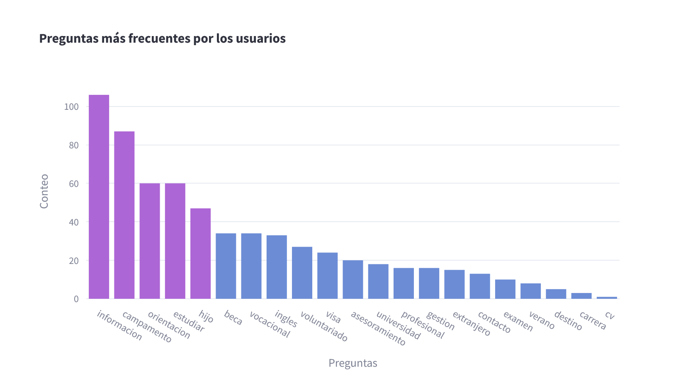
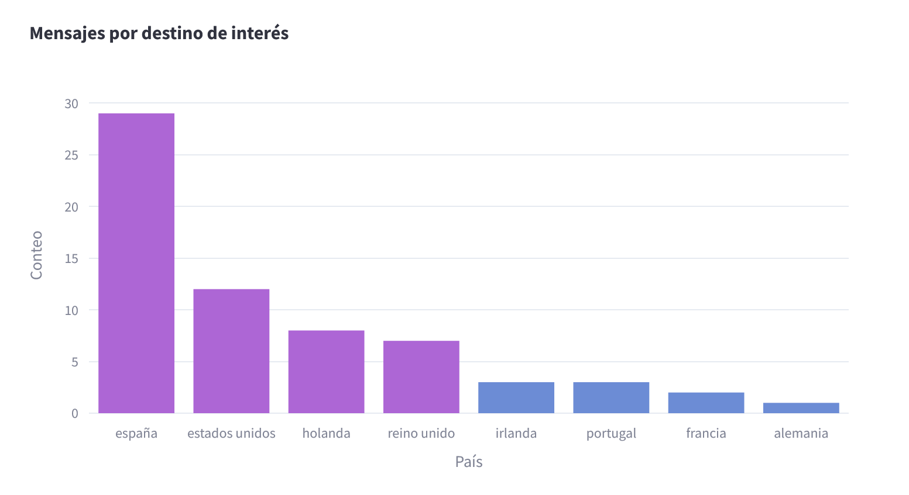
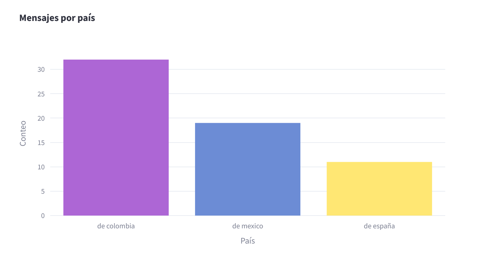

# Proyecto de Visualización de Datos con Streamlit

Este proyecto utiliza Streamlit para mostrar gráficos interactivos basados en datos almacenados en una base de datos desplegada en Render. Los gráficos se generan a partir de datos de mensajes, analizando preguntas frecuentes, la procedencia de los mensajes y destinos de interés.

## Descripción

La aplicación tiene las siguientes funcionalidades:

- **Preguntas más frecuentes**: Muestra un gráfico de barras con las categorías de preguntas más comunes.
- **Desde dónde nos escriben**: Presenta un gráfico de barras con los países desde donde se envían los mensajes.
- **Destinos de interés**: Muestra un gráfico de barras con los destinos más consultados.

## Configuración del Proyecto

### Prerrequisitos

- Python 3.7 o superior
- Streamlit
- psycopg2
- pandas
- folium
- plotly

### Instalación

1. Clona este repositorio:

    ```bash
    git clone https://github.com/tu_usuario/tu_repositorio.git
    cd tu_repositorio
    ```

2. Crea y activa un entorno virtual:

    ```bash
    python -m venv env
    source env/bin/activate  # En Windows usa `env\Scripts\activate`
    ```

3. Instala las dependencias:

    ```bash
    pip install -r requirements.txt
    ```

### Variables de Entorno

Asegúrate de configurar las variables de entorno para conectarte a la base de datos de Render. Puedes crear un archivo `.env` en el directorio raíz del proyecto con el siguiente contenido:

    
    my_database=tu_base_de_datos
    my_host=tu_host
    my_password=tu_contraseña
    my_port=tu_puerto
    my_user=tu_usuario
   

Y luego carga estas variables en tu script de Streamlit utilizando `python-dotenv`:

```bash
from dotenv import load_dotenv
load_dotenv()
```

## Ejecución

Para ejecutar la aplicación de Streamlit, usa el siguiente comando:

```bash
streamlit run app.py
```
## Uso

Una vez que la aplicación esté en funcionamiento, puedes navegar por las diferentes secciones utilizando el menú lateral:

    Home: Página de inicio con una imagen y una descripción básica.
    Preguntas más frecuentes: Visualiza las categorías de preguntas más comunes.
    Desde dónde nos escriben: Muestra un gráfico con los países de origen de los mensajes.
    Destinos de interés: Presenta un gráfico con los destinos más consultados.

## Despliegue
### Despliegue en Render

Para desplegar la base de datos en Render, sigue estos pasos:

    Crea una nueva base de datos en Render.
    Configura las variables de entorno necesarias en el panel de configuración de Render.
    Asegúrate de que tu aplicación de Streamlit está configurada para conectarse a esta base de datos utilizando las variables de entorno.

### Despliegue en Streamlit Cloud

Para desplegar tu aplicación en Streamlit Cloud:

    Sube tu repositorio a GitHub.
    Ve a Streamlit Cloud y conecta tu cuenta de GitHub.
    Selecciona tu repositorio y el archivo app.py como la entrada de tu aplicación.
    Configura las variables de entorno en la configuración de la aplicación en Streamlit Cloud.

### Capturas de Pantalla






### Contribuciones

Las contribuciones son bienvenidas. Por favor, abre un issue o un pull request para cualquier mejora o corrección.
Licencia

Este proyecto está licenciado bajo la MIT License.